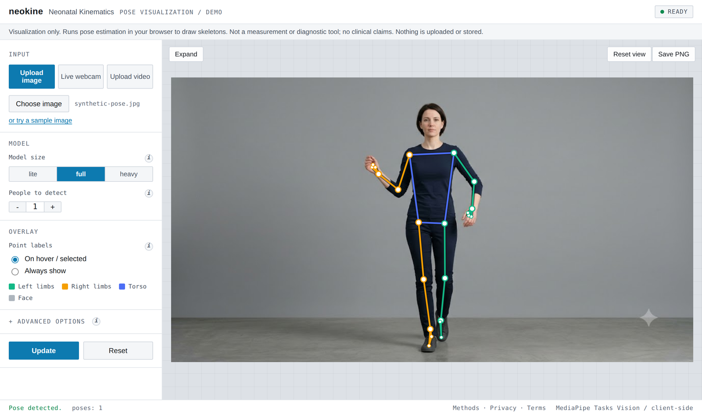

# neokine — Neonatal Kinematics

Pose-visualization demo for infant movement. It runs [MediaPipe
Pose](https://ai.google.dev/edge/mediapipe/solutions/vision/pose_landmarker) to
draw a skeleton over an image, video, or webcam feed and to plot simple
kinematics (displacement, velocity, left–right asymmetry) over time.

**Try it:** [robinsonvidva.com/neokine](https://robinsonvidva.com/neokine/)



> **Visualization only.** These are estimates in normalized image units — no
> camera calibration, depth, or scale reference. This is **not** a measurement
> or diagnostic tool and makes no clinical claims. Nothing is uploaded; all
> processing happens on your machine or in your browser.

There are **two independent front-ends** to the same idea:

| | Web app (`docs/`) | Streamlit app (`app/`) |
|---|---|---|
| Where pose runs | In the browser (MediaPipe WASM from a CDN) | Locally in Python (MediaPipe on-device) |
| Install | **None** | conda / pip env (see below) |
| Needs internet | Yes (loads library + model from CDN) | Only on first run (downloads the model once) |
| Best for | Quick demo, sharing a link | Local/offline use, batch video + kinematics |

---

## 1. Web app — `docs/` (no install)

A static site (HTML/CSS/JS). MediaPipe's library, WASM runtime, and the pose
model are fetched from a CDN at runtime, so there are no dependencies to
install.

**Hosted:** published via GitHub Pages from `docs/`, served at
`https://robinsonvidva.com/neokine/` (custom domain, via Cloudflare) and
`https://robinson-vidva.github.io/neokine/`.

**Run locally** (ES modules require `http://`, not opening the file directly):

```bash
python3 -m http.server 8000 --directory docs
# then open http://localhost:8000
```

Requires a modern browser and an internet connection (for the CDN assets).

### Web app features

- **Inputs:** upload an image or video, or use the live webcam;
  **drag-and-drop** onto the stage; or one-click **sample image / clip**
  (`docs/samples/`) — AI-generated synthetic people (not real, not infants) so
  you can try it with no file of your own.
- **Pipeline — Vanilla vs Enhanced:** a toggle for the **Enhanced (SyRIP-tuned)**
  mode. Same model, tuned inference (not retrained weights): it upscales small
  images and tries 0/90/180/270° rotations, keeping the orientation the model is
  most confident about. On the SyRIP infant test set this lifted detection from
  94.6% to 99.2% with zero lost detections — recovering inverted / small /
  crawling poses the plain model misses. Applies to still images. See
  [METHODS](METHODS.md#enhanced-syrip-tuned-inference).
- **Overlay:** region-colored skeleton, per-joint/per-group display filters,
  hover tooltips, click-to-pin, zoom/pan, and **motion trails** (a tracked
  joint's path across the video frames).
- **Kinematics** (video): per-joint displacement, mean velocity, the left–right
  asymmetry index `(L − R)/(L + R)`, and **joint angles** (elbow/knee/hip, with
  range of motion). All in normalized image units — a visualization, not a
  calibrated measurement.
- **Export:** **Save PNG** (the overlay) and **Save CSV** (per-frame landmarks +
  joint angles).
- **Quality of life:** remembers your settings across visits (localStorage),
  **dark mode** (follows your OS), video keyboard shortcuts (Space = play/pause,
  ←/→ = step frames), keyboard-navigable controls, and a retry button if the
  model fails to load.

---

## 2. Streamlit app — `app/` (local Python)

Runs MediaPipe on your machine. The `.task` model files download once from
Google's CDN into `app/models/` (gitignored) and are reused offline afterwards.

### Setup

**Option A — conda (recommended):**

```bash
conda env create -f environment.yml
conda activate neokine
```

**Option B — pip + venv:**

```bash
python3 -m venv .venv
.venv/bin/pip install -r requirements-app.txt
```

> **Python 3.9–3.12 only.** `mediapipe==0.10.14` has no wheels for Python 3.13+.
> Wheels are available for macOS (arm64/x86_64), Linux x86_64, and Windows.

### Run

From the repo root:

```bash
streamlit run app/streamlit_app.py          # conda
# or
.venv/bin/streamlit run app/streamlit_app.py # pip/venv
```

Opens at `http://localhost:8501`.

### Features

- **Inputs:** upload image, upload video, or live webcam (via
  `streamlit-webrtc`; falls back to single-snapshot if those packages are
  unavailable).
- **Model:** `lite` / `full` / `heavy` variants, `numPoses`, and the two
  MediaPipe confidence thresholds.
- **Overlay:** region-colored skeleton with a dark contrast outline, per-joint
  and per-group display filters, hover tooltips, click-to-pin, zoom/pan.
- **Video:** duration cap + sampling rate, cancellable batched processing with a
  live progress bar, Play/Stop + Prev/Next + speed + a seek slider, and a
  **kinematics panel** (per-joint trajectory, displacement, mean velocity, and
  the left–right asymmetry index `(L − R)/(L + R)`).

---

## Repository layout

```
docs/                 Web app (static; deployed to GitHub Pages)
  index.html, styles.css, js/{app,pose}.js
app/                  Streamlit app (local Python)
  streamlit_app.py    UI and control flow
  pose_backend.py     MediaPipe Tasks PoseLandmarker wrapper + model download
  overlay.py          Plotly overlay (interactive) + OpenCV overlay (playback)
  kinematics.py       displacement / velocity / asymmetry
  viz_config.py       skeleton colors, connections, display groups
  models/             downloaded .task models (gitignored)
shared/skeleton.py    MediaPipe-33 landmark names/edges (shared constants)
environment.yml       conda setup for the Streamlit app
requirements-app.txt  pip setup for the Streamlit app
```

The Python analysis/evaluation code (SyRIP dataset) lives in a separate
`syrip-analysis` project; this repo is just the two visualization front-ends.

---

## License, privacy & terms

neokine is licensed under the [Apache License 2.0](LICENSE). See [`NOTICE`](NOTICE)
for third-party components (MediaPipe, Streamlit, OpenCV, Plotly, and others),
which are loaded from a CDN or installed from PyPI and remain under their own
licenses.

- **[Methods & limitations](METHODS.md)** — exactly what is computed (model,
  formulas, sampling), how the numbers were validated, and the sources of error.
- **[Privacy Policy](PRIVACY.md)** — your media is processed on your device and
  never uploaded; no cookies, analytics, or tracking. Settings are stored
  locally in your browser only.
- **[Terms of Use](TERMS.md)** — the "as is", not-a-medical-device terms.

> **Not a medical device.** neokine is a visualization demo only. Its outputs are
> estimates in normalized image units with no calibration, depth, or scale
> reference. It is **not** a measurement or diagnostic tool and makes no clinical
> claims. It is provided "as is", without warranty of any kind (see the LICENSE).

To cite this project, use the metadata in [`CITATION.cff`](CITATION.cff) (GitHub
shows a "Cite this repository" button). Contributions are welcome — see
[`CONTRIBUTING.md`](CONTRIBUTING.md).
